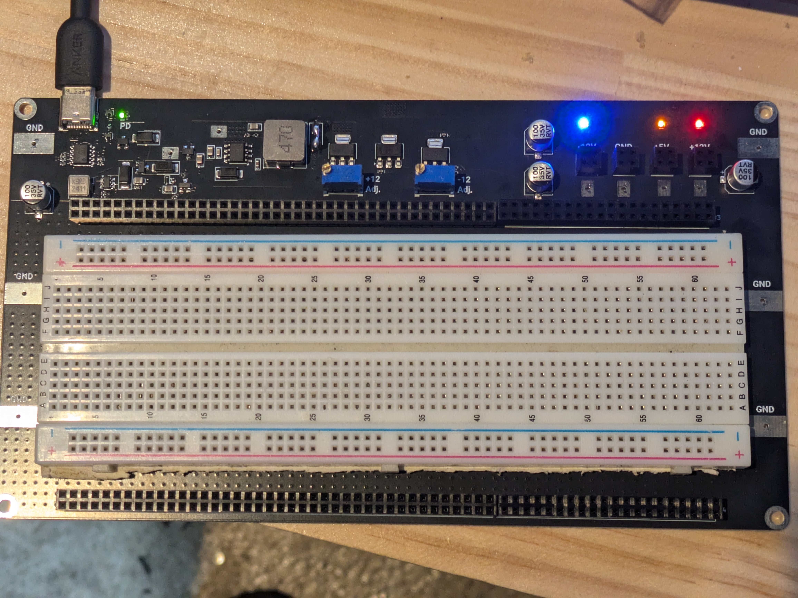

# Analog Breadboard Base san

[日本語](README.ja.md)

You have two cows. You want to build analog circuit with both positive/negative rails...

Here it is!

## Features

- USB PD supported. Use 15V if the PD power source if available
- When not, internal DC-DC can supply 15V(with a limited power which USB port can supply)
  - Confirmed working with M2 Macbook Air and Chuwi Freebook(meaning you can use this board with normal USB type-C port on your PC)
- Has 15V(unregulated) and -15V(unregulated) test point for the convinience of advanced users..
